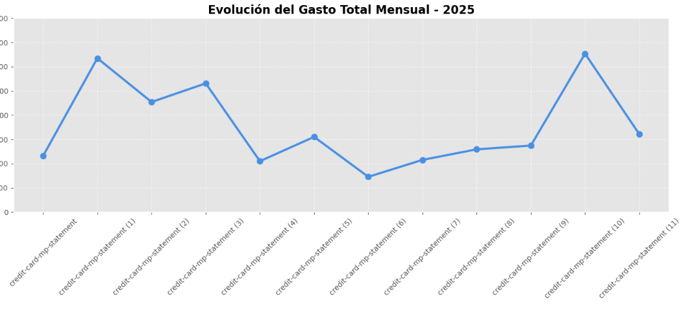
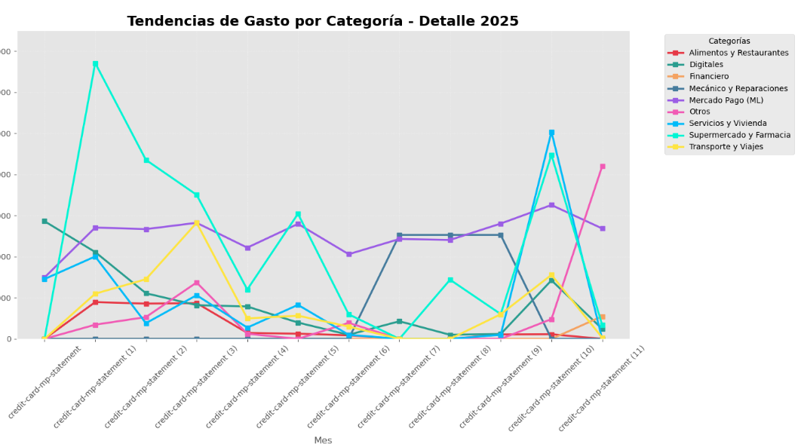

# "Why this project?"
I built this to demonstrate my ability to handle unstructured data and the ETL (Extract, Transform, Load) lifecycle. 
It highlights my proficiency in Python for practical automation and my commitment to data privacy.

# Financial Statement Analysis Tool: Mercado Pago Edition
##📌 Project Overview
This project automates the extraction and analysis of financial data from Mercado Pago (Mexico) bank statements. It solves the challenge of converting unstructured PDF documents into a structured format for personal expense tracking and data-driven financial planning.

The tool is designed to process multiple months of statements seamlessly, identifying trends, top expenses, and category distributions.

## 🛠️ Key Technical Features
1. Robust PDF Data Extraction
Unlike simple copy-paste methods, this tool uses pdfplumber to programmatically read the document's layout. It handles multi-page statements and variable transaction counts without manual intervention.

2. Context-Aware Parsing (Keyword Sensitivity)
The core engine utilizes Keyword Trigger Sensitivity. Instead of reading the whole document blindly, the script looks for specific structural "anchors" unique to Mercado Pago statements:

Start Trigger: It begins data collection only after detecting keywords like Movimientos and MXN$.

End Trigger: It concludes the extraction at the Subtotal anchor.
This ensures that metadata, headers, and legal footers are ignored, resulting in a clean dataset.

3. Dynamic Regex Categorization
Using advanced Regular Expressions (Regex), the tool automatically classifies transactions into categories like Digital Services, Groceries, Travel, and Utilities. This mapping is robust enough to handle common merchant variations and regional descriptions.

## 📊 Visual Demonstration
The following charts illustrate the automated output of the pipeline using a structured multi-month dataset.

  
   
  <em>Figure 1: Automated time-series analysis showing monthly spending evolution.</em>

  
   
  <em>Figure 2: Categorized spending trends across multiple months, identifying key consumption patterns.</em>

## 🚀 How to Use
Clone the repository.

Place your Mercado Pago PDF statements in the data/ folder.

Run the financial_analyzer.py script.

View the generated reports and visualizations in the console and plot windows.

